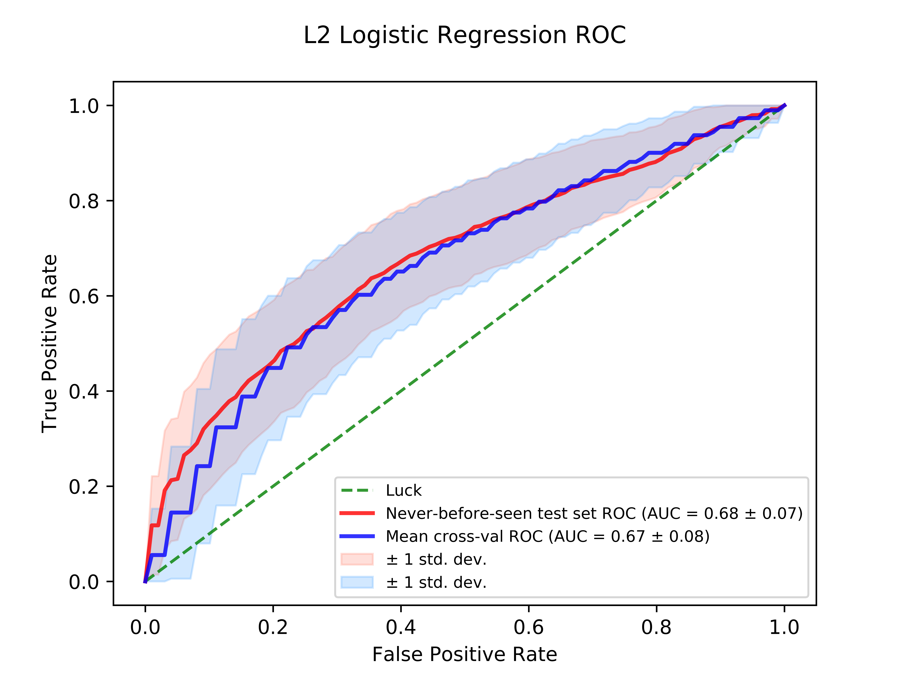

```{r setup, include=FALSE}
knitr::opts_chunk$set(echo = TRUE)
library(reticulate)
use_python("/usr/local/bin/python3", required = TRUE)
py_config()
```


```{python,engine.path = '/usr/local/bin/python3'}
## Let's make sure we are using the Python version we want
import sys
print(sys.version)
## For me this is Python3, which is what I want
## We want to be working from our project directory so make sure you are in the right place
import os
print(os.getcwd())
## I'm in my DeepLearning project directory.

###### IMPORT MODULES #### ###
import matplotlib
matplotlib.use('TkAgg')
import matplotlib.pyplot as plt
from sklearn.linear_model import LogisticRegression
from sklearn.model_selection import train_test_split
from sklearn.model_selection import KFold, cross_val_score, validation_curve
from sklearn import linear_model
import numpy as np # linear algebra
import pandas as pd # data processing, CSV file I/O (e.g. pd.read_csv)
from sympy import *
from sklearn.model_selection import GridSearchCV
from sklearn.neural_network import MLPClassifier
import numpy as np
from scipy import interp
from itertools import cycle
from sklearn import svm, datasets
from sklearn.metrics import roc_curve, auc
from sklearn.model_selection import StratifiedKFold
import numpy as np
import pandas as pd
# dependencies for statistic analysis
from scipy import stats
#importing our parameter tuning dependencies
from sklearn.neighbors import KNeighborsClassifier
from sklearn.model_selection import (cross_val_score, GridSearchCV, StratifiedKFold, ShuffleSplit )
#importing our dependencies for Feature Selection
from sklearn.feature_selection import (SelectKBest, chi2, RFE, RFECV)
from sklearn.linear_model import LogisticRegression, RandomizedLogisticRegression
from sklearn.ensemble import ExtraTreesClassifier
from sklearn.cross_validation import ShuffleSplit
from sklearn.ensemble import RandomForestClassifier
from sklearn.metrics import f1_score
# Importing our sklearn dependencies for the modeling
from sklearn.ensemble import RandomForestClassifier
from sklearn.neighbors import NearestNeighbors
from sklearn.preprocessing import StandardScaler
from sklearn.cross_validation import KFold
from sklearn.model_selection import train_test_split
from sklearn import metrics
from sklearn.metrics import (accuracy_score, confusion_matrix, classification_report, roc_curve, auc)
from sklearn.neural_network import MLPClassifier
from itertools import cycle
from scipy import interp
import warnings
from sklearn.model_selection import StratifiedKFold
warnings.filterwarnings('ignore')

## Read in the data
shared = pd.read_table("data/baxter.0.03.subsample.shared")
shared.head()
meta = pd.read_table("data/metadata.tsv")

## Check and visualize the data
meta.head()
shared.head()

## Remove unnecessary columns from meta
meta = meta[['sample','dx']]

## Rename the column name "Group" to match the "sample" in meta
shared = shared.rename(index=str, columns={"Group":"sample"})

## Merge the 2 datasets on sample
data=pd.merge(meta,shared,on=['sample'])

## Remove adenoma samples
data= data[data.dx.str.contains("adenoma") == False]

## Drop all except OTU columns for x
x = data.drop(["sample", "dx", "numOtus", "label"], axis=1)
## Cancer =1 Normal =0
diagnosis = { "cancer":1, "normal":0}
##Generate y which only has diagnosis as 0 and 1
y = data["dx"].replace(diagnosis)
# y = np.eye(2, dtype='uint8')[y]
## Drop if NA elements
y.dropna()
x.dropna()

## Split the data to generate training and test sets %80-20
x_train, x_test, y_train, y_test = train_test_split(x, y, test_size=0.2, random_state=82089, shuffle=True)

######### Logistic Regression ###################

## Define L2 regularized logistic classifier
logreg = linear_model.LogisticRegression(C=0.001)
kfold = StratifiedKFold(n_splits=5)
cv_results = cross_val_score(logreg, x_train, y_train, cv=kfold)
print (cv_results.mean()*100, "%")

## Fit to training sets
logreg.fit(x_train, y_train)

## Plot ROC curve for Logistic Regression training cross validation
cv = StratifiedKFold(n_splits=5)
tprs = []
aucs = []
mean_fpr = np.linspace(0, 1, 100)

X=x_train.values
Y=y_train.values


#logistic_plot = plt.figure()
i = 0
for train, test in cv.split(X,Y):
    probas_ = logreg.fit(X[train], Y[train]).predict_proba(X[test])
    # Compute ROC curve and area the curve
    fpr, tpr, thresholds = roc_curve(Y[test], probas_[:, 1])
    tprs.append(interp(mean_fpr, fpr, tpr))
    tprs[-1][0] = 0.0
    roc_auc = auc(fpr, tpr)
    aucs.append(roc_auc)
    plt.plot(fpr, tpr, lw=1, alpha=0.3, label='ROC fold %d (AUC = %0.2f)' % (i, roc_auc))
    i += 1


plt.plot([0, 1], [0, 1], linestyle='--', color='r', label='Luck', alpha=.8)
mean_tpr = np.mean(tprs, axis=0)
mean_tpr[-1] = 1.0
mean_auc = auc(mean_fpr, mean_tpr)
std_auc = np.std(aucs)
plt.plot(mean_fpr, mean_tpr, color='b', label=r'Mean ROC (AUC = %0.2f $\pm$ %0.2f)' % (mean_auc, std_auc), lw=2, alpha=.8)
std_tpr = np.std(tprs, axis=0)
tprs_upper = np.minimum(mean_tpr + std_tpr, 1)
tprs_lower = np.maximum(mean_tpr - std_tpr, 0)
plt.fill_between(mean_fpr, tprs_lower, tprs_upper, color='grey', alpha=.2, label=r'$\pm$ 1 std. dev.')
plt.xlim([-0.05, 1.05])
plt.ylim([-0.05, 1.05])
plt.xlabel('False Positive Rate')
plt.ylabel('True Positive Rate')
plt.title('Logistic Regression ROC\n')
plt.legend(loc="lower right", fontsize=8)
plt.show()
#logistic_plot.savefig('results/figures/Logit_Baxter.png', dpi=1000)

## Predict using the Logistic Regression classifier on the test set
y_pred = logreg.predict(x_test)
print('Accuracy of logistic regression classifier on test set: {:.2f}'.format(logreg.score(x_test, y_test)*100), "%")
```
Output image:


